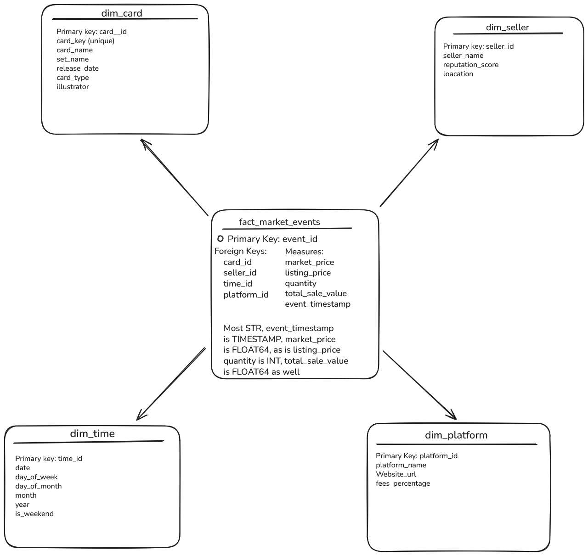

# Real-time Pokémon TCG Market Analytics Platform

## Project Goal
Build a data pipeline and analytics platform for processing and analyzing simulated Pokémon TCG market data in near real-time, providing actionable insights into card prices, market trends, and supply/demand dynamics.

## 1. Project Setup
### 1.1 AWS Account and IAM Configuration
- Signed up for AWS account.
- Enabled MFA for root user account.
- Created `PokemonTCG_Admins` IAM group with `AdministratorAccess` policy attached.
- Created IAM user `bendehass-dev-user` with programmatic and console access, and added to `PokemonTCG_Admins` group.
- Downloaded and securely stored IAM user credentials (Access Key ID & Secret Access Key).
### 1.2 AWS S3 and Data Lake Storage
- Created `pokemon-tcg-raw-data-bdehass` and `pokemon-tcg-processed-data-bdehass` buckets in S3.
- Used us-east-2 for storage.
- Block all public access to maintain security.
- Enabled versioning on raw data bucket to grasp understanding.
#### 1.2.1 Python Interaction (boto3)
- boto3 is the AWS SDK
- `list_s3_buckets()` names all buckets under provided credentials.
- `upload_file_to_s3(local_file_path, bucket_name, s3_key)` uploads a local file into provided s3 bucket.
- `download_file_from_s3(bucket_name, s3_key, local_file_path)` downloads a file from a provided s3 bucket to a local path.
- To run `s3_utils.py`, call directly via `python src/s3_utils.py`.
- Both `my_first_upload.txt` and `downloaded_from_s3.txt` are test files that won't be committed.
## 2. Data Warehousing (Google BigQuery)
### 2.1 BigQuery Fundamentals & GCP Project Setup
- Established a new GCP Project `pokemon-data-project-bdehass`.
- Understood that BigQuery is a serverless, columnar, highly scalable cloud data warehouse.
- Learned the columnar data storage benefits BigQuery by allowing access to a subset of columns as necessary.
- Designed a rough sketch for BigQuery schema to account for expected values attached to incoming data.
### 2.2 Schema Design
- Gained understanding on what star/snowflake schema are and theirs benefits.
- Determined Star Schema a better fit for this project due to its faster queries and simple structure for easier joins.
- Designed a high-level Star Schema  with a central fact table `fact_market_events` surrounded by four dim tables `dim_card`, `dim_seller`, `dim_platform`, and `dim_time`.
### 2.3 BigQuery DDL and Optimization
- The `fact_market_events` table is partitioned by the `event_timestamp` column and clustered by `card_id` and `platform_id`. This strategy significantly improves query performance and reduces costs by limiting the amount of data scanned.
### 2.4 Table Creation
- Tables were created in BigQuery using DDL. Used BigQuery explorer to reach tables in order to verify schema, partitioning, and clustering aer as desired.